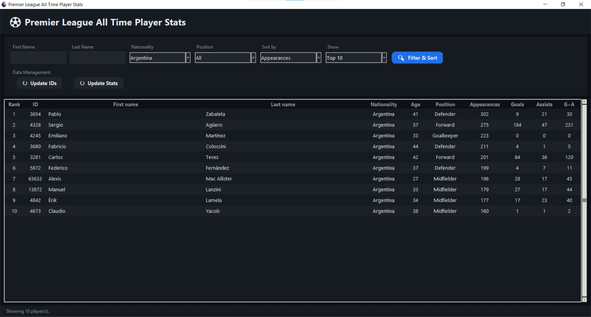

# ⚽ Premier League All-Time Player Stats App

A modern desktop application built with **Python (Tkinter)** that allows users to explore, filter, and analyze Premier League player statistics using real-time data from an online API.

---

## Overview

This project provides an interactive GUI for retrieving and analyzing football player data, including appearances, goals, assists, and more. It features a clean dark-themed interface, dynamic filtering, and data persistence using CSV files.

The application is designed with usability and performance in mind, making it easy to browse large datasets efficiently.

---

## Features

### Data Collection

* Fetch all Premier League player IDs via API
* Retrieve detailed stats for each player:

  * Appearances
  * Goals
  * Assists
  * Goal contributions (G+A)

### Filtering & Sorting

* Filter by:

  * First name
  * Last name
  * Nationality
  * Position (Goalkeeper, Defender, Midfielder, Forward)
* Sort by:

  * ID
  * Appearances
  * Goals
  * Assists
  * G+A
* View:

  * Top 5
  * Top 10
  * All players

### User Interface

* Clean dark mode UI
* Custom styled buttons and dropdowns
* Responsive table with alternating row colors
* Progress bar for long API operations
* Real-time status updates

### Data Persistence

* Stores data locally using:

  * `player_ids.txt`
  * `players_data.csv`
* Avoids redundant API calls by caching existing players

---

## Tech Stack

* **Python 3**
* **Tkinter** – GUI framework
* **Requests** – API communication
* **Pandas** – Data processing and storage
* **Threading** – Non-blocking UI updates

---

## Usage

Run the application:

```bash
python main.py
```

### First-time setup:

1. Click **"Update IDs"** to fetch player IDs
2. Click **"Update Stats"** to retrieve player statistics

After that, you can freely filter and explore the dataset.

---

## Screenshot


